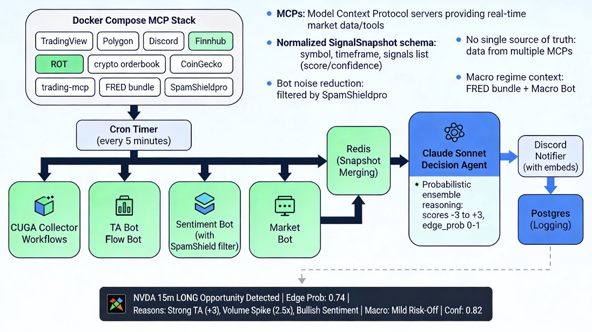

# trade-alert

> Production trading alert engine built on [CUGA](./README.cuga.md).

10 MCP ensemble (TA · flow · sentiment · macro) → Claude Sonnet probabilistic reasoning → Discord trade playbooks with entry, stop, target, thesis & edge probability.



## Documentation
- **Full spec & architecture:** [`CUGA-Trading-Alert-System-SPEC-v1.2.md`](./CUGA-Trading-Alert-System-SPEC-v1.2.md)
- **CUGA upstream docs:** [`README.cuga.md`](./README.cuga.md)

## Quick Start

### 1. Prerequisites
- Python 3.11+
- Docker & Docker Compose
- API keys: Anthropic, Finnhub, FRED, Polygon.io, Discord bot token

### 2. Environment setup
```bash
cp .env.example .env
# Fill in all required values (ANTHROPIC_API_KEY, DISCORD_BOT_TOKEN, etc.)
```

### 3. Run unit tests (no infrastructure needed)
```bash
pip install pydantic httpx psycopg2-binary redis pytest pytest-cov
pytest tests/unit/ -v
```

### 4. Launch infrastructure
```bash
docker compose up -d redis postgres
# Wait for Postgres to initialize, then apply the schema:
docker compose exec postgres psql -U trade_alert -d trade_alert -f /docker-entrypoint-initdb.d/schema.sql
```

### 5. Run the alert engine
```bash
# Start all MCP servers + CUGA orchestrator
docker compose up -d

# Or run locally for development:
python -m cuga run --workflows-dir workflows/ --schedule
```

### 6. Mock mode (no real API keys)
```bash
MOCK_DATA=1 python -m cuga run --workflows-dir workflows/ --schedule
```

## Project Structure

| File                     | Purpose                                               |
| ------------------------ | ----------------------------------------------------- |
| `models.py`              | Pydantic schemas: Signal, Snapshot, PlaybookAlert     |
| `merger.py`              | Deduplicates & ranks snapshots from Redis             |
| `db.py`                  | Postgres insert/update/query for alerts table         |
| `notifier_and_logger.py` | Discord embeds + Postgres logging                     |
| `healthcheck.py`         | Redis/Postgres/MCP health checks + JSONL logging      |
| `outcome_tracker.py`     | Resolves open alerts via Polygon.io price polling     |
| `normalizers/`           | 5 normalizers (TA, flow, sentiment, market, macro)    |
| `workflows/`             | CUGA YAML workflows (collectors, decisions, notifier) |
| `.env.example`           | All environment variables with defaults               |

## Testing

```bash
# Unit tests (160+ tests, no infrastructure)
pytest tests/unit/ -v

# With coverage
pytest tests/unit/ --cov=. --cov-report=term-missing

# Integration smoke test (optional — needs Docker)
python tests/integration_smoke.py
```
