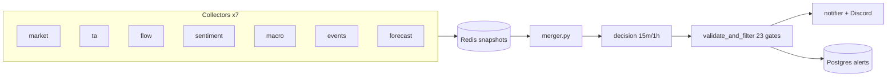

# trade-alert architecture

High-level view of the production alert pipeline. Authoritative schemas and gate
inventory remain in [`spec-v1.3.md`](spec-v1.3.md) (SSOT).

## Pipeline flow

## MCP servers (12)

| Port | Service | Role |
| ---- | ------- | ---- |
| 8001 | tradingview-mcp | Charting |
| 8002 | polygon-mcp | Market data |
| 8003 | discord-mcp | Messaging |
| 8004 | finnhub-mcp | Fundamentals |
| 8005 | rot-mcp | Trending tickers |
| 8006 | edgar-mcp | Filings |
| 8007 | yfinance-mcp | Backup quotes |
| 8008 | trading-mcp | Universe screen |
| 8009 | fred-mcp | Macro |
| 8010 | spamshield-mcp | Spam filter |
| 8011 | alpaca-mcp | Brokerage |
| 8012 | timesfm-mcp | Forecasts |

## Workflow DSL (7 step types)

| Type | Purpose |
| ---- | ------- |
| `code` | Sandboxed Python (`workflow_sandbox.py`) |
| `tool_call` | Single MCP invocation |
| `parallel_tool_calls` | Concurrent MCP calls |
| `llm` | Claude decision step |
| `workflow` | Nested YAML with `inputs` |
| `parallel` | Thread-pool sub-workflows |
| `conditional` | Branch on expression |

Orchestrators delegate to `orchestrator-base.yaml` with timeframe inputs.

## Gate order (summary)

1. Schema / timeframe validation  
2. Symbol hallucination check  
3. Deterministic `sources_agree`  
4. EP ceiling by source count  
5. Entry order and drift  
6. Session / extended-hours overlays  
7. VIX hard/soft gates  
8. EP / SA / CONF / R:R thresholds  
9. WATCH policy and dedup  

See `validate_and_filter.py` and SSOT §10.2–10.4.

## Root vs subdirectories

| Location | Purpose |
| -------- | ------- |
| **Root** (`*.py`) | Pipeline orchestration: merger, decision helpers, validate-and-filter entry point, notifier, healthcheck, prompt manager, MCP runners, dashboard API |
| **`gates/`** | Server-side validation gate logic (regime, session, dedup, watch, candidate evaluation) |
| **`normalizers/`** | Collector snapshot normalizers (one module per signal family) |
| **`resilience/`** | Shared resilience patterns (MCP error handler, retries) |
| **`workflows/`** | CUGA YAML orchestrators, collectors, and decision workflows |
| **`scripts/`** | Ops scripts, MCP server framework, DB maintenance (`purge_old_data.py`, `enable_partitioning.sql`) |
| **`deployment/`** | Hetzner deploy scripts, Helm charts, prod validation checklists |
| **`tests/unit/`** | trade-alert unit tests (CUGA upstream tests live in `tests/cuga_upstream/`) |

New modules: gate logic → `gates/`; normalizers → `normalizers/`; resilience → `resilience/`; workflow YAML → `workflows/`; orchestration Python → root until the module count for a new concern exceeds five (then add a subdirectory).
